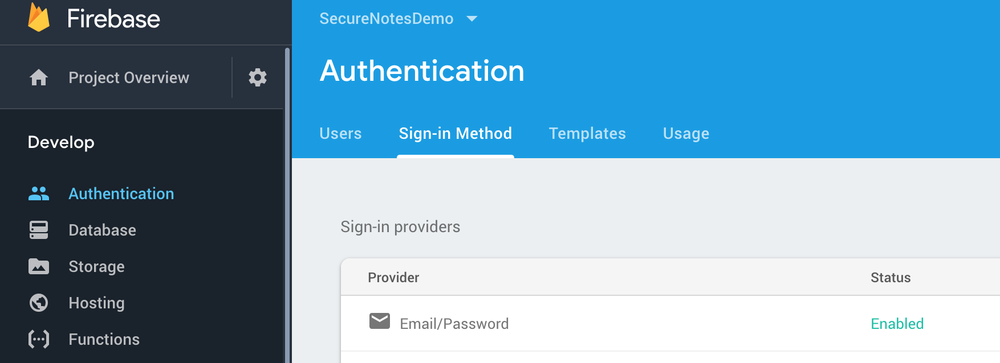
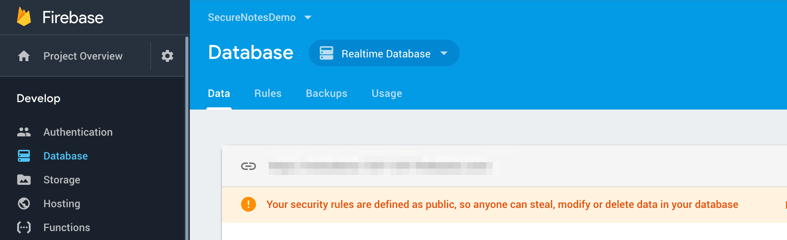
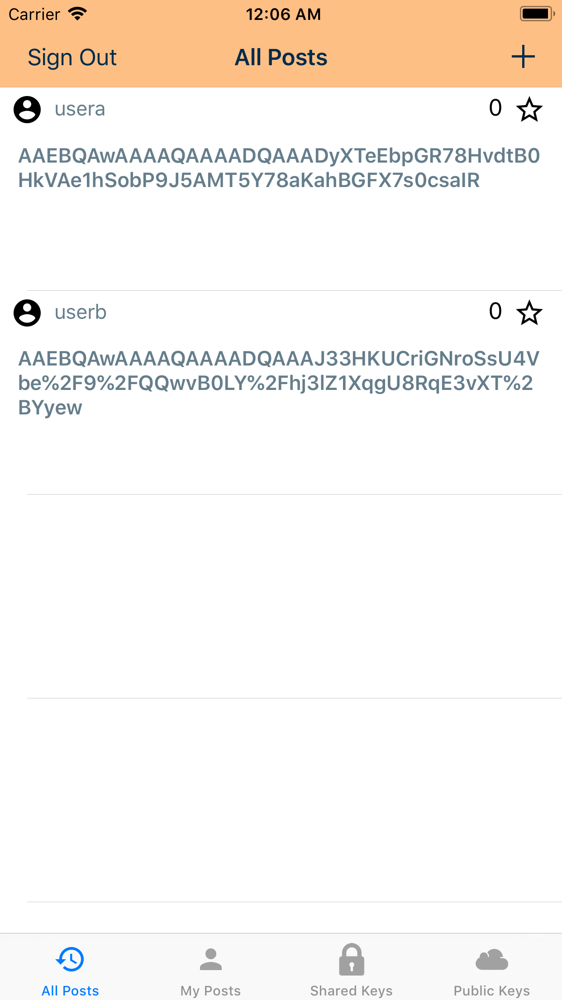
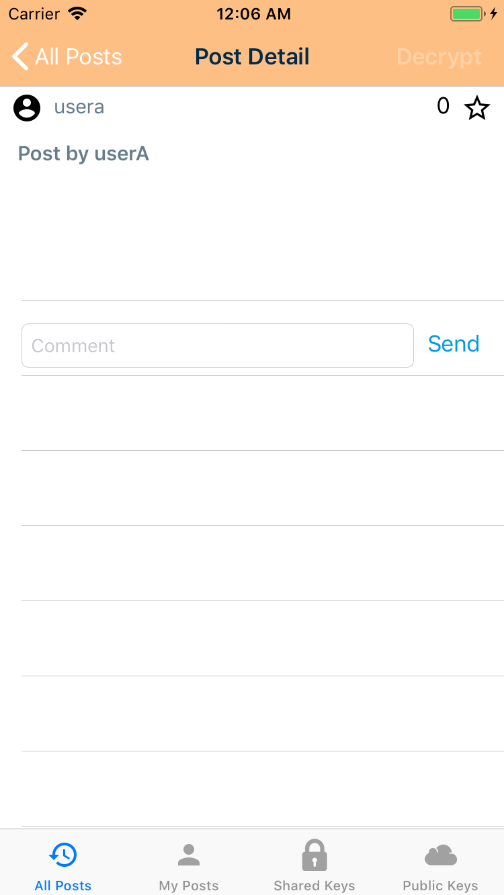
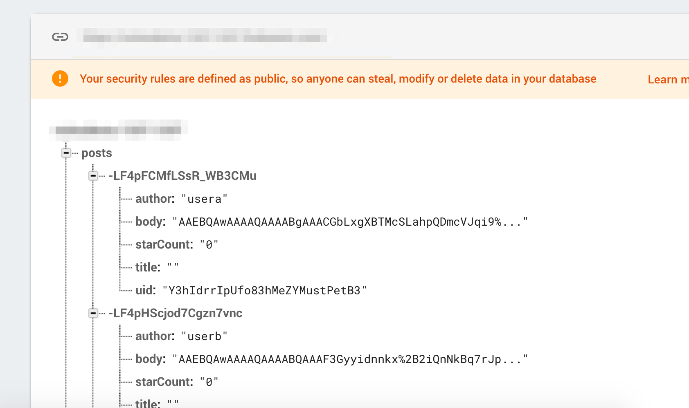
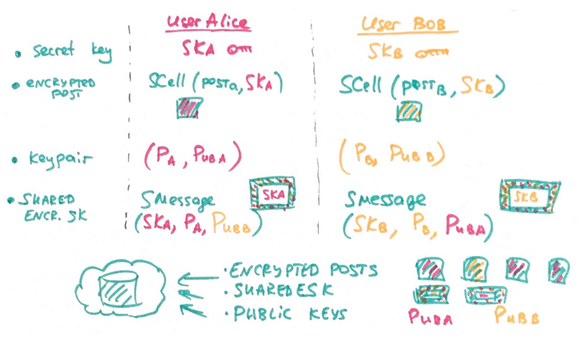
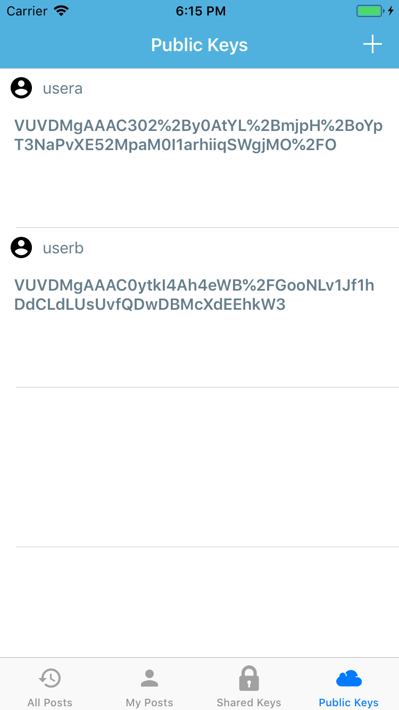
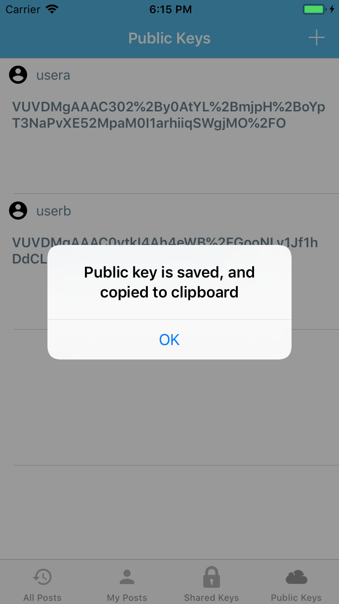
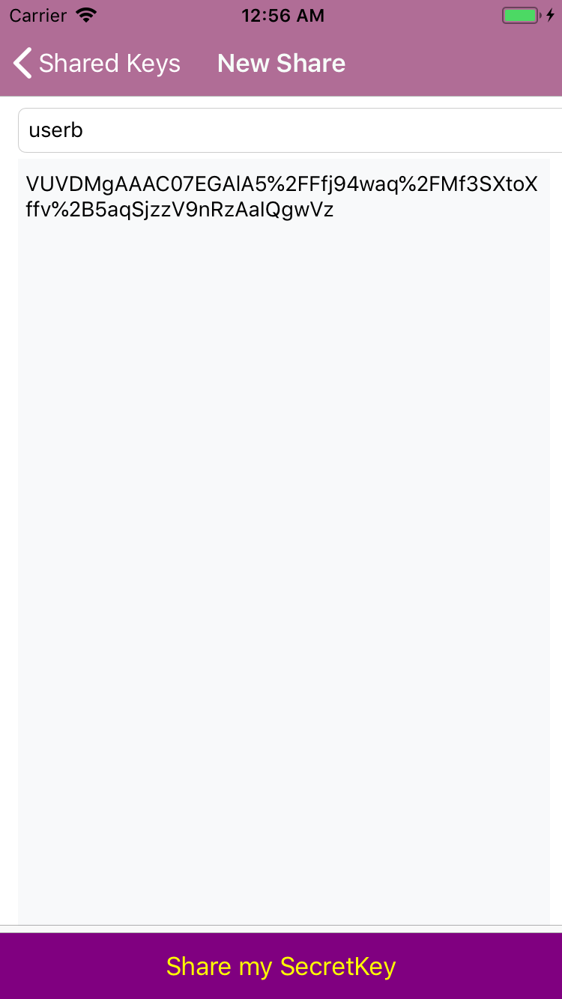

# SecureNotes ZKA app


## What is Zero Knowledge Architectures

ZKA is a design principle.

In simple words, everything you do on a Zero Knowledge system is encrypted before it is sent to the server and the key to the encryption is also never revealed to the vendor.

Zero knowledge algorithms and protocols ensure that no keys, passwords, files, or any other sensitive material ever gets transferred in an unencrypted or reversible form. There is no point in time when encryption keys or unencrypted files are visible to the servers or service administrators.

## Principles

1. End-to-end encrypted clients.
2. All operations are on encrypted data.
3. Server knows nothing about the nature of data.

## Where it's used?

- Messaging (like e2ee chats)
- Authentication (Zero Knowledge Proof Protocol enables two parties to compare a secret without exposing it, efficiently avoiding leakage of secrets during transmission)
- Data sharing (medical data sharing)

Read more [in Medium post](https://medium.com/@vixentael/zero-knowledge-architectures-for-mobile-applications-b00a231fda75).

## Making Secure Notes app

### How app works?

This is a simple notes application, that uses Firebase as backend. Users should sign up / login on start, then they can post notes. Own notes are visible on `My Posts` page, notes from all users – on `All Posts` page.

This app is remake of [Firebase Database example app](https://github.com/firebase/quickstart-ios/tree/master/database).

### Firebase setup

Before continue:

1. Change bundle name.
2. Follow Firebase [setup tutorial](https://firebase.google.com/docs/ios/setup).
3. Register app in the Firebase app console.
4. Receive `GoogleService-Info.plist` and add it to the project.
5. In your Firebase console, app settings, enable Authentication via email.
6. Enable relatime database in a test mode.






## Encrypting own notes

Of course, notes might be rather sensitive, so users asked us to encrypt their notes, making them visible only to authors.
We selected symmetric encryption for this purpose: use one key to encrypt and decrypt note. Each user has its own unique key.

*Encrypting post:*

1. Generate user secret key (SK). Keep it in a secure place! Use KDF to make secret key stronger.
2. Encrypt post body using SK and AES.
3. Encode post body to base64 with percent encoding (for safe transfer via network).
4. Save post to the backend.

*Decrypting post:*
	
1. Retrieve user secret key (SK).
2. Decode post body from base64 and remove percent encoding.
3. Decrypt post body using SK and AES.
4. Show decrypted post.

#### Implementation details

In our example we will use [Themis Secure Cell in Seal mode](https://github.com/cossacklabs/themis/wiki/Secure-Cell-cryptosystem) for post encryption. It has pre-built KDF, and uses AES256 GCM. Data will be encrypted and appended by auth tag, saving it from tampering.

*Create SecureCell:*

```swift
    // 1. create encryptor with own secret key
    guard let cellSeal = TSCellSeal(key: mySecretKeyData) else {
      print("Failed to encrypt post: error occurred while initializing object cellSeal")
      throw EncryptionError.cantCreateSecureCell
    }
```

*Encrypting post body:*

```swift
    var encryptedMessage: Data = Data()
    do {
      encryptedMessage = try cellSeal.wrap(postBodyString.data(using: .utf8)!,
                                           context: nil)
    } catch let error as NSError {
      print("Failed to encrypt post: error occurred while encrypting body \(error)")
      throw EncryptionError.cantEncryptPostBody
    }
```

*Decrypting encrypted post body:*

```swift
    var decryptedMessage: Data = Data()
    do {
      decryptedMessage = try cellSeal.unwrapData(encryptedPostData,
                                                 context: nil)
    } catch let error as NSError {
      print("Failed to decrypt post: error occurred while decrypting: \(error)")
      throw EncryptionError.cantDecryptPostBody
    }
```

See example in [Themis repo](https://github.com/cossacklabs/themis/blob/master/docs/examples/swift/ThemisSwift/ThemisSwift/Classes/AppDelegate.swift#L51).

#### App code

Check `EncryptionEngine` and all its extensions. Fill empty methods in `EncryptionEngine+OwnPost`, `EncryptionEngine+DecryptOtherPost`.

#### Screenshots

For demonstration purposes I decrypt posts only on `PostDetails` page, leaving them encrypted in the list:


 



## Sharing encrypted posts between users

Suddenly our users asked about sharing feature: they want to see notes of their friends. But each note is encrypted, so we should share users' secret keys. But these keys are very sensitive, we can't sharing them plaintext. So we use asymmetric encryption to wrap SK using own private key and friend's public key. Then share wrapped key with a friend.

*Technically saying:*

User Alice shares her encrypted post and encrypted secret key for user Bob:

1. Has own secret key `SK-a`.

2. Encrypts own posts with `SK-a`:

	`EncrPost-a = SecureCell(Post-a, SK-a)`

3. Shares her public key with Bob (`Pub-a`).

4. Encrypts `SK-a` for her friend Bob `SharedKey-(a->b)` using own private key (`Priv-a`) and Bob's public key (`Pub-b`):

	`SharedKey-(a->b) = SecureMessage(SK-a, Priv-a, Pub-b)`

User Bob wants to read message from User Alice:

1. Shares his public key with Alice (`Pubk-b`).

2. Decrypts Alice secret key using own private key (`Priv-b`) and her public key (`Pub-a`):

	`SK-a = SecureMessage(SharedKey-(a->b), Priv-b, Pub-a)`

3. Decrypts Alice post using her secret key:

	`Post-a = SecureCell(EncrPost-a, SK-a)`

And vice versa :)

Here is the scheme:



*Where to find public keys?*

Usually public keys are stored in PKI (public key infrastructure), where they are saved from tampering. User Alice should trust PKI service to be sure that `Pub-b` really belongs to Bob. There are different ways how to setup PKI, for example using mediator service like keybase.io. 

In our example we will save public key to the same backend (_Note: don't do like this in production_).

#### Implementation details

In our example we will use [Themis Secure Message](https://github.com/cossacklabs/themis/wiki/Secure-Message-cryptosystem) for asymmetric keys encryption. Each key will be encrypted and signed by user using EC keypair.

#### Encrypting own SK:

1. Generate own Keypair. Prepare own private key as Data. Prepare own secret key as Data.
2. Get other user public key as String, decode it from base64 and remove percent escaping.
3. Create SecureMessage container with own private key and other user public key.
4. Encrypt own secret key using Secure Message for other user.
5. Encode SK to String (add base64 and percent encoding).
6. Share to the backend


*Generate keypair:*

```swift
    // Generating EC keys
    guard let keyGeneratorEC: TSKeyGen = TSKeyGen(algorithm: .EC) else {
        print("Error occurred while initializing object keyGeneratorEC", #function)
        return
    }
    let privateKeyEC: Data = keyGeneratorEC.privateKey as Data
    let publicKeyEC: Data = keyGeneratorEC.publicKey as Data
```

*Create SecureMessage container with own private key and other user public key:*

```swift
    // 3. create Asym encryptor using own private key and other user' public key
    guard let encrypter = TSMessage.init(inEncryptModeWithPrivateKey: myPrivateKey,
                                         peerPublicKey: otherUserPublicKey) else {
                                          print("Error occurred while creating TSMessage Encryptor")
                                          throw EncryptionError.cantCreateSecureMessage
    }
```

*Encrypt own secret key for other user:*

```swift
    // 4. encrypt own secret key for another user
    var encryptedSecretKey: Data = Data()
    do {
      encryptedSecretKey = try encrypter.wrap(mySecretKey.data(using: .utf8))
    } catch let error as NSError {
      print("Failed to encrypt own SK: error occurred while encrypting: \(error)")
      throw EncryptionError.cantEncryptOwnSecretKey
    }
```

#### Decrypting other user post:

1. Generate own Keypair. Prepare own private key as Data.
2. Prepare other user encrypted SK as String
3. Create SecureMessage container with own private key and other user public key.
4. Decode encryped SK to Data (remove percent encoding, create Data object from base64-encoded string).
5. Decrypt other user SK using Secure Message.
5. Encode SK to String (user base64-encoding and percent encoding).
6. Decrypt other user post using his secret key.
7. Show decrypted post.

*Create SecureMessage container with own private key and other user public key:*

```swift
    // 3. create Asym decrypter using own private key and other user' public key
    guard let decrypter = TSMessage.init(inEncryptModeWithPrivateKey: myPrivateKey,
                                         peerPublicKey: otherUserPublicKey) else {
                                          print("Error occurred while creating TSMessage Decryptor")
                                          throw EncryptionError.cantCreateSecureMessage
    }
```

*Decrypting other user SK:*

```swift
    // 5. decrypt own secret key for another user
    var decryptedSecretKey: Data = Data()
    do {
      decryptedSecretKey = try decrypter.unwrapData(encryptedSKData)
    } catch let error as NSError {
      print("Failed to decrypt somebody's SK: error occurred while decrypting: \(error)")
      throw EncryptionError.cantEncryptOwnSecretKey
    }
```

See example in [Themis repo](https://github.com/cossacklabs/themis/blob/master/docs/examples/swift/ThemisSwift/ThemisSwift/Classes/AppDelegate.swift#L238).

#### App code

Check `EncryptionEngine` and all its extensions. Fill empty methods in `EncryptionEngine+Keypair`, `EncryptionEngine+EncryptSK`, `EncryptionEngine+DecryptSK`.


#### Screenshots

You need to run two applications (UserAlice and UserBob).

1. UserAlice posts encrypted post. 
2. Now we want UserBob to be able to decrypt it, so UserAlice should share own encrypted SK to user Bob.
3. UserBob opens `PublicKeys` list and posts own public key.
4. UserAlice opens `PublicKeys` and copies UserBob' public key (tap on the cell).
5. UserAlice opens `SharedKeys`, taps Add button. Inputs UserBob name into text field and pasts UserBob public key into textview. On pressing save UserAlice encrypts own SK using UserBob public key and own private key, and posts it to the backend.
6. UserBob opens `SharedKeys`, sees sharedKey from UserAlice, and saves this key locally (tap on the cell). Now he needs her public key to be able to decrypt sharedKey.
7. UserAlice opens `PublicKeys` list and posts own public key.
8. UserBob opens `PublicKeys` list, finds public key from UserAlice, saves it locally (tap on the cell).
9. UserBob opens encrypted post by Alice and decrypts it.

If Alice wants to read posts by Bob, Bob needs to share his SK with her.

For demonstration purposes I decrypt posts only on `PostDetails` page, leaving them encrypted in the list:

   

 


You can see video of app working in [pics/ZKA-app-working](pics/ZKA-app-working.mov).


## Security warning

This example has many security flaws, especially in storing secret and public keys. Please don't use it as production-ready system. It's just an illustration of ZKA approach.

Of course, Firebase configuration should be changed: use private database, do not publish credentials (API keys).

## Next steps

1. Keys:

	* Save keys (secret keys, keypair, decrypted keys) in a Keychain.
	* Store keys encrypted with masterkey derived from user password after login.
	* Build proper PKI.
	* Remove encrypted keys from list after decrypting/using.

2. Login:

	* Hash user password during sign up process.
	* Add login via TouchID / FaceID on each app opening.

3. Put overlay view instead of system screenshot during app switching.

	* Add view on `applicationDidEnterBackground`.
	* Remove view on `applicationDidBecomeActive`.

4. Networks (might be complicated to do because of Firebase library):

	* Add SSL pinning (get Firebase certificate, pin certificate, check on connection start) https://infinum.co/the-capsized-eight/ssl-pinning-revisited
	* Add transport encryption over SSL 
	
		- Why: https://twitter.com/vixentael/status/1003206652206739456
		- How: https://github.com/cossacklabs/themis/wiki/Secure-Session-cryptosystem

5. Code obfuscation:

	* https://github.com/rockbruno/swiftshield
	* https://medium.com/theappspace/increase-the-security-of-your-ios-app-by-obfuscating-sensitive-strings-swift-c915896711e6

6. Monitor 3rd party dependencies for vulnerabilities and critical bugs:

	* https://www.whitesourcesoftware.com/
	* https://www.blackducksoftware.com/
	* https://snyk.io/

## Stay tuned

More to read & watch:

- https://github.com/vixentael/my-talks
